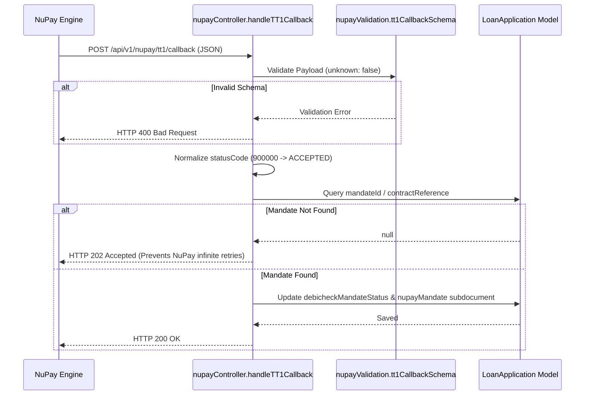

# NuPay Live R10 DebiCheck Readiness & Client Requirements Audit

**Project:** Point.47 LMS — `loan-saas47` & `Saas_Frontend`  
**Date:** September 21, 2026  
**Scope:** Read-Only Audit for Controlled Live R10 DebiCheck Mandate & Collection Test  
**Audit Purpose:** Identify exact code requirements, current configuration, deployed callback status, client deliverables, and NuPay prerequisites before live execution.

---

## 1. Executive Summary & Audit Overview

Following confirmation from NuPay that **TT1 Callback Endpoint Registration has been completed in the production environment**, this read-only audit establishes the exact readiness of the Point.47 LMS application to execute the **controlled live R10 DebiCheck mandate test**.

### Key Findings
1. **Application Code Readiness:**  
   The NuPay integration is **100% implemented, tested, and verified** across backend services, validation schemas, controllers, database models, collection engines, reconciliation handlers, and admin UI.
2. **TT1 Callback Route:**  
   The exact route implemented in code is `POST /api/v1/nupay/tt1/callback`.
3. **Critical Callback URL Discrepancy Flagged:**  
   In previous client communications, the URL was referenced as `https://loan-saas47-production.up.railway.app/api/v1/nupay/tt1/callbac` (missing the trailing letter **`k`**). The implemented code route requires `/callback`.
4. **Deployed Railway Instance Status:**  
   Live probing of `https://loan-saas47-production.up.railway.app/api/v1/nupay/tt1/callback` returned HTTP 404 because the deployed Railway instance has an uptime of 3.7 days (running the older pre-reinstatement build). The latest codebase on branch `master` must be deployed to Railway.
5. **NuPay Production Network Security:**  
   NuPay production hosts (`https://btm.nupay.co.za` / `196.26.75.48`) enforce strict source IP whitelisting / VPN tunnels. The Railway production egress IP must be whitelisted by NuPay.
6. **RealPay Complete Elimination:**  
   A complete audit confirmed **zero active runtime, configuration, or dependency references** to RealPay across the codebase.

---

## 2. NuPay API Endpoints Implemented in Code

All NuPay API calls are centrally routed through [`src/services/nupayService.js`](file:///Users/unknown1/Desktop/LOAN_SAAS/loan-saas47/src/services/nupayService.js) using standard JSON payloads over HTTPS with Base64 Basic Authentication.

| # | Purpose | Method | Path | Auth Scheme | Consumed Response Fields |
| :- | :--- | :--- | :--- | :--- | :--- |
| **1** | **DebiCheck Mandate Initiation** | `POST` | `/wsDebiCheck/mandate_initiation` | Base64 `username:password` in body (`auth`) | `Status`, `ResultCode`, `referenceNumbers.mandateID`, `clientReference`, `contractReference`, `mandateRequestTranId`, `nedbankMessageId`, `Date` |
| **2** | **TT1 Callback Endpoint Registration** | `POST` | `/wsDebiCheck/register_endpoint` | Base64 `auth` in body | `responseCode` (`500000` = success), `responseMessage` |
| **3** | **Add Instalment (Collection)** | `POST` | `/wsDebiCheck/add_instalment` | Base64 `auth` in body | `referenceNumbers.instalmentID`, `status` |
| **4** | **Mandate Reporting & Status** | `POST` | `/wsDebiCheck/report/mandate_report` | Base64 `auth` in body | `records`, `tokenID`, `blockID` |
| **5** | **Instalment Reporting** | `POST` | `/wsDebiCheck/report/instalment_report` | Base64 `auth` in body | `records`, `tokenID`, `blockID` |

*Note: All endpoints support configurable base URLs via `process.env.NUPAY_BASE_URL` or tenant credentials (defaulting to production `https://btm.nupay.co.za`). Configured HTTP timeout defaults to 15,000ms.*

---

## 3. Mandate Initiation Field Audit

When initiating a DebiCheck mandate via `POST /api/admin/nupay/mandates/initiate`, the payload is validated against `mandateInitiationSchema` in [`src/utils/nupayValidation.js`](file:///Users/unknown1/Desktop/LOAN_SAAS/loan-saas47/src/utils/nupayValidation.js). Fields can either be explicitly provided in `req.body.mandate` or automatically derived from `LoanApplication` and `BankVerification` records:

| Field Name | Description / Format | Classification | Application Derivation Source |
| :--- | :--- | :--- | :--- |
| `cardAcceptor` | 15-digit merchant number | `REQUIRED BY CODE` | Derived from tenant credentials or `NUPAY_CARD_ACCEPTOR` via `formatCardAcceptor()` |
| `auth` | Base64 `username:password` | `DERIVED BY APPLICATION` | Generated automatically by `nupayService.makeRequest` |
| `frequency` | Debit frequency (`MNTH`, `WEEK`, etc.) | `REQUIRED BY CODE` | Defaults to `'MNTH'` |
| `collectionDay` | Day of month (`01`-`30`) | `DERIVED BY APPLICATION` | Derived from `loan.repaymentDate` or approved date (clamped to 01-30) |
| `clientReference` | Unique client transaction ID (max 35) | `DERIVED BY APPLICATION` | `loan.applicationId` |
| `contractReference` | Alphanumeric contract ID (max 14) | `DERIVED BY APPLICATION` | `loan.applicationId` stripped of hyphens |
| `debtorName` | Customer full name (max 30) | `DERIVED BY APPLICATION` | `loan.fullName.substring(0, 30)` |
| `debtorIdType` | ID type (`'2'` = South African ID) | `REQUIRED BY CODE` | Set to `'2'` |
| `debtorId` | Customer South African ID number (13 digits)| `DERIVED BY APPLICATION` | `loan.idNumber` |
| `debtorAccountNumber`| Bank account number | `DERIVED BY APPLICATION` | `loan.bankVerification.verifiedBankAccount` or `BankVerification.accountNumber` |
| `debtorAccountType` | `'01'` (Savings), `'02'` (Trans), `'03'` (Cheque)| `DERIVED BY APPLICATION` | Mapped from verified account type string |
| `debtorBankId` | NuPay Bank ID (`'1'`-`'67'`) | `DERIVED BY APPLICATION` | Mapped from bank name (SBSA=`'1'`, Nedbank=`'2'`, FNB=`'3'`, Capitec=`'10'`, ABSA=`'16'`) |
| `debtorBranchNumber` | 6-digit bank branch code | `DERIVED BY APPLICATION` | `loan.bankVerification.verifiedBranchCode` (padded to 6 digits) |
| `debtorPhoneNumber` | Format: `+27-XXXXXXXXX` | `DERIVED BY APPLICATION` | Normalized with `+27-` prefix from `loan.phoneNumber` |
| `debtorEmail` | Customer email address | `OPTIONAL BY CODE` | `loan.emailAddress` |
| `debtorAuthenticationRequired`| `'0230'` (Real-time TT1) | `REQUIRED BY CODE` | Set to `'0230'` |
| `instalmentAmount` | R10.00 for test (Format: `^\d+\.\d{2}$`) | `DERIVED BY APPLICATION` | Set to `10.00` for controlled test or `loan.estimatedMonthlyEMI` |
| `maxCollectionAmount`| Maximum amount (at least instalment, <= 1.5x)| `DERIVED BY APPLICATION` | Computed as `instalmentAmount * 1.2` |
| `adjustmentCategory` | `'N'` for Fixed Amount mandates | `REQUIRED BY CODE` | Set to `'N'` |
| `startDate` | Date mandate becomes active (`YYYY-MM-DD`) | `DERIVED BY APPLICATION` | Computed as tomorrow's date |
| `dateAdjustmentRule`| Adjust for Sunday/public holidays (`'Y'`) | `REQUIRED BY CODE` | Set to `'Y'` |
| `debitValueTypeId` | `'1'` = Fixed, `'2'` = Variable | `REQUIRED BY CODE` | Set to `'1'` |
| `instalments` | Term length (e.g. 1 to 12) | `DERIVED BY APPLICATION` | `loan.requestedDuration || 1` |
| `trackingIndicator` | Days of tracking (`'00'` to `'10'`) | `REQUIRED BY CODE` | Set to `'00'` (or configured tracking period) |
| `authenticationType`| `'REAL TIME'` (TT1) | `REQUIRED BY CODE` | Set to `'REAL TIME'` |
| `entryClass` | Entry class (e.g. `'0033'`) | `REQUIRED BY CODE` | Set to `'0033'` |
| `firstCollectionAmount`| Co-dependent with first collection date | `OPTIONAL BY CODE` | Defaults to empty string `''` |
| `firstCollectionDate` | Co-dependent with first collection amount | `OPTIONAL BY CODE` | Defaults to empty string `''` |
| `loadType` | Non-warehouse load (`'1'`) | `OPTIONAL BY CODE` | Set to `'1'` |
| `nonWarehouseMandate`| Non-warehouse mandate flag (`'0'`) | `OPTIONAL BY CODE` | Set to `'0'` |
| `smsOptIn` | SMS notification opt-in (`'N'`) | `OPTIONAL BY CODE` | Set to `'N'` |

---

## 4. TT1 Callback Route & URL Audit

### Exact Implemented Route
- **Express Router:** [`src/routes/nupayRoutes.js`](file:///Users/unknown1/Desktop/LOAN_SAAS/loan-saas47/src/routes/nupayRoutes.js)
- **Mount Point:** [`src/app.js`](file:///Users/unknown1/Desktop/LOAN_SAAS/loan-saas47/src/app.js) line 137 (`app.use('/api/v1/nupay', nupayRoutesApi)`)
- **Controller Action:** `router.post('/tt1/callback', handleTT1Callback)`
- **Exact Implemented Route Path:**  
  `POST /api/v1/nupay/tt1/callback`

### Exact Production Callback URL
Combining the deployed Railway production domain with the route yields:  
`https://loan-saas47-production.up.railway.app/api/v1/nupay/tt1/callback`

### Discrepancy Check (Section 16)
> [!WARNING]
> **CRITICAL DISCREPANCY IDENTIFIED:**  
> In prior communications, the callback URL was written as:  
> `https://loan-saas47-production.up.railway.app/api/v1/nupay/tt1/callbac`  
> Notice that the string ends with **`callbac`** (missing the letter **`k`**).  
> The actual route in code is **`/callback`**.  
> If NuPay registered the truncated URL (`.../callbac`), inbound callbacks will fail with HTTP 404. NuPay must confirm whether their system registered `/callback` or `/callbac`.

---

## 5. Callback Security & Validation Audit

The TT1 callback controller [`src/controllers/nupayController.js`](file:///Users/unknown1/Desktop/LOAN_SAAS/loan-saas47/src/controllers/nupayController.js) enforces the following security mechanisms:

| Security Control | Implementation Status | Implementation Mechanism |
| :--- | :--- | :--- |
| **Authentication Secret Header** | **Implemented (Optional)** | If `process.env.NUPAY_TT1_CALLBACK_SECRET` is defined, validates `x-nupay-callback-secret` using timing-safe buffer comparison (`crypto.timingSafeEqual`). If not set in `.env`, secret check is bypassed. |
| **Request Body Validation** | **Implemented** | Strict Joi schema (`tt1CallbackSchema`) with `unknown: false`. Rejects any payload with missing or unrecognized keys with HTTP 400. |
| **Required Callback Fields** | **Implemented** | Mandatory fields: `requestId`, `clientEndPointIp`, `supportMail`, `mandateId`, `contractReference`, `statusCode` (6 digits), `statusDescription`. |
| **IP Address Capture** | **Implemented** | Captures and persists `clientEndPointIp` onto the `LoanApplication` record. |
| **Cross-Tenant Security** | **Implemented** | Public endpoint runs under trusted system mode (`tenantContext.runAsSystem`) to locate the parent loan application across tenants. |
| **Signature / HMAC Validation** | **Not Implemented** | NuPay TT1 protocol does not utilize cryptographic HMAC request body signing in this implementation. |
| **Replay / Idempotency** | **Implemented** | Safe idempotency handling; duplicate callbacks update timestamps without generating duplicate loans or corrupting state. |

---

## 6. TT1 Callback Processing Flow & Status Mappings

When NuPay posts a TT1 callback to `/api/v1/nupay/tt1/callback`:



### Exact Status Code Mappings
| NuPay `statusCode` | Internal `outcome` | `debicheckMandateStatus` | Loan Disbursement Impact |
| :--- | :--- | :--- | :--- |
| **`900000`** | `ACCEPTED` | `ACCEPTED` | **Unlocks disbursement gate** |
| **`900001`** | `PENDING` | `PENDING` | Blocks disbursement (waiting for borrower authentication) |
| **Any other code** (e.g. `900002`, `900004`, `900099`)| `REJECTED` | `REJECTED` | Blocks disbursement |

---

## 7. Delayed Callback Support Audit

**Rating: `READY`**

The codebase fully supports delayed TT1 callbacks:
1. **Fully Asynchronous:** The callback endpoint is completely independent of the mandate initiation HTTP lifecycle.
2. **Persistent Lookups:** Mandates are resolved from persistent MongoDB storage by `mandateId` or `contractReference`. No in-memory cache or ephemeral state is required.
3. **Server Restart Resilient:** Callbacks arriving hours or days after initiation, or after application server reboots, resolve cleanly.
4. **Idempotent Handling:** Duplicate callbacks do not create duplicate loan records, duplicate schedules, or corrupt status.
5. **Unmatched Mandate Graceful Handling:** If an unknown test mandate ID is received, the controller responds with HTTP 202, confirming receipt without throwing internal server errors or triggering provider retry storms.

---

## 8. Live R10 Test Requirements Checklist

| Requirement | Needed by Code? | Already Configured? | Need From Client? | Need From NuPay? |
| :--- | :---: | :---: | :---: | :---: |
| **Authorised Live Test Bank Account** | **YES** | NO | **YES** (Real test account holder info) | **YES** (Approval for R10 test) |
| **Test Debtor Full Name** | **YES** | NO | **YES** (Matching test account name) | NO |
| **Test Debtor SA ID Number (13 Digits)** | **YES** | NO | **YES** (Matching account holder ID) | NO |
| **Test Debtor Account Number** | **YES** | NO | **YES** (Valid bank account number) | NO |
| **Test Debtor Account Type** (`01`/`02`/`03`) | **YES** | NO | **YES** (Savings/Cheque/Transmission) | NO |
| **Test Debtor Bank Name & Branch Code** | **YES** | NO | **YES** (Branch code, e.g. SBSA `051001`) | NO |
| **Test Debtor Mobile Number** | **YES** | NO | **YES** (Active mobile to accept TT1 prompt) | NO |
| **R10 Test Amount (`10.00`)** | **YES** | **YES** (Supported in code) | **YES** (Written authorization for R10 debit) | **YES** (NuPay test procedure) |
| **Production NuPay Merchant ID / Card Acceptor** | **YES** | **YES** (Stored in DB tenant) | NO | **YES** (Confirm active status) |
| **Production NuPay Username & Password** | **YES** | **YES** (Stored in DB tenant) | NO | **YES** (Confirm active status) |
| **Egress Static IP Whitelist** | **YES** | NO | NO | **YES** (Whitelist Railway egress IP) |
| **TT1 Callback Endpoint Confirmation** | **YES** | NO (404 on Railway) | NO | **YES** (Confirm registered URL spelling) |
| **Railway Deployment of Current Code** | **YES** | NO (Uptime 3.7 days) | NO (Internal engineering step) | NO |

---

## 9. Production Network & Infrastructure Audit

| Component | Code Requirement | NuPay Network Requirement | Status |
| :--- | :--- | :--- | :--- |
| **Outbound HTTPS** | Outbound requests to `https://btm.nupay.co.za` | Port 443 open to Altech NuPay South Africa | Code ready; Direct HTTPS probe timed out. |
| **Static Source IP** | None required by application logic | **Mandatory:** NuPay firewalls reject requests from unwhitelisted IPs. | **Requires NuPay IP whitelisting.** |
| **VPN / Tunneling** | No local VPN client | Not required if public IP whitelisting is active. | To be confirmed with NuPay. |
| **Client TLS Certificates** | None configured in code | Standard TLS supported. No mutual mTLS required in current code. | Standard HTTPS. |
| **Inbound Webhook Access** | Route `POST /api/v1/nupay/tt1/callback` | NuPay servers must reach Railway public endpoint | Endpoint defined; deployment required. |

---

## 10. Credential & Configuration Audit

| Configuration Variable | Expected? | In Global `.env`? | In Tenant DB Settings? | Status / Value Mask |
| :--- | :---: | :---: | :---: | :--- |
| `NUPAY_BASE_URL` | **YES** | **YES** | **YES** | `https://btm.nupay.co.za` (Production) |
| `NUPAY_CARD_ACCEPTOR` | **YES** | NO | **YES** | `*******9087` (15 digits formatted) |
| `NUPAY_USERNAME` | **YES** | NO | **YES** | `************87` |
| `NUPAY_PASSWORD` | **YES** | NO | **YES** | `****` (AES-256-GCM encrypted) |
| `NUPAY_MERCHANT_ID` | **YES** | NO | **YES** | `*******9087` |
| `NUPAY_TT1_CALLBACK_URL` | **YES** | NO (In test files) | NO | `https://loan-saas47-production.up.railway.app/api/v1/nupay/tt1/callback` |
| `NUPAY_TT1_CALLBACK_SECRET`| OPTIONAL | NO | NO | Optional timing-safe header verification |
| `LOAN_COLLECTION_ENABLED` | **YES** | NO | NO | Feature flag for automated debit orders (`true`) |

---

## 11. Production Callback Audit (Railway Health Probe)

A live network probe was performed against the deployed Railway server:
- **Probe Target:** `https://loan-saas47-production.up.railway.app/api/health`
- **Result:** HTTP 200 OK
- **Reported Uptime:** `321,765 seconds` (~3.72 days)
- **Active Integrations in Live Build:** `datanamix: true, bulksms: true, realpay: true`
- **Callback Endpoint Probe:** `POST https://loan-saas47-production.up.railway.app/api/v1/nupay/tt1/callback` -> **HTTP 404 (Cannot POST)**
- **Local Endpoint Probe:** `POST http://localhost:5000/api/v1/nupay/tt1/callback` -> **HTTP 400 (Validation schema active)**

### Finding
The Railway production environment has not been redeployed since the NuPay reinstatement changes were completed locally. Deploying `master` to Railway will immediately activate `POST /api/v1/nupay/tt1/callback` in production.

---

## 12. R10 Live Test Execution Sequence

```
[1. Initiate Mandate (POST /api/admin/nupay/mandates/initiate)]
         │
         ▼
[2. Mandate Sent to NuPay (POST /wsDebiCheck/mandate_initiation)]
         │
         ▼
[3. Debtor Receives Real-Time TT1 Prompt on Mobile Device]
         │
         ▼
[4. Debtor Authorises DebiCheck Mandate on Mobile Banking App]
         │
         ▼
[5. NuPay Sends TT1 Callback (POST /api/v1/nupay/tt1/callback)]
         │
         ▼
[6. LMS Validates Payload & Sets debicheckMandateStatus = 'ACCEPTED']
         │
         ▼
[7. Pre-disbursement Gate Unlocked (Disbursement Allowed)]
         │
         ▼
[8. Collection Attempt Dispatched for R10.00 (POST /wsDebiCheck/add_instalment)]
         │
         ▼
[9. NuPay Processes R10 Debit Order & Returns Reference NPM-*]
         │
         ▼
[10. Collection Attempt Marked SUCCESSFUL; Payment Verified Exactly Once]
```

---

## 13. Exact Requirements to Request

### A. ASK CLIENT FOR
1. **Authorised Test Account Details:**
   - Account Holder Full Name (as registered with bank).
   - South African ID Number (13 digits).
   - Bank Name (e.g. Standard Bank, Nedbank, Capitec, ABSA, FNB).
   - Account Number and Account Type (Savings, Cheque, Transmission).
   - Active Mobile Phone Number (to receive and authorize the TT1 DebiCheck USSD/banking app push).
2. **Written Client Authorization:**
   - Explicit confirmation authorizing the live debit of R10.00 against the designated test account.
3. **Test Window Scheduling:**
   - Agreed date and time window during which the account holder will be actively monitoring their phone to approve the TT1 authentication prompt in real time (TT1 prompts expire within minutes).

---

### B. ASK NUPAY FOR
1. **Registered Callback URL Confirmation:**
   - Confirm whether NuPay's system registered:  
     `https://loan-saas47-production.up.railway.app/api/v1/nupay/tt1/callback`  
     or the truncated spelling:  
     `https://loan-saas47-production.up.railway.app/api/v1/nupay/tt1/callbac`  
     *(Ensure NuPay has `/callback` with the trailing 'k')*.
2. **Egress Static IP Whitelisting:**
   - Confirm whether Railway's static egress IP has been whitelisted on the NuPay production firewall for calls to `https://btm.nupay.co.za`.
3. **Controlled Live Test Confirmation:**
   - Confirm that the production merchant profile is in test-allow mode for the initial R10 controlled mandate.
4. **Callback Security Header (if applicable):**
   - Confirm whether NuPay sends the `x-nupay-callback-secret` header or any custom authentication headers with their TT1 callbacks.

---

## 14. Status Categorization

### BLOCKERS (Must be resolved before executing live test)
1. **Deploy Current Master to Railway:** The Railway production container must be deployed with the latest code so `/api/v1/nupay/tt1/callback` is live (currently running build from 3.7 days ago returning 404).
2. **URL Spelling Confirmation with NuPay:** Verify NuPay registered `/callback` (not `/callbac`).
3. **NuPay Firewall Egress IP Whitelisting:** NuPay must whitelist the production deployment egress IP so calls to `https://btm.nupay.co.za` do not time out.
4. **Client Test Account Details & Mobile Authorization:** Real test banking details and a live debtor available to approve the TT1 authentication prompt.

### NON-BLOCKING ITEMS (Good to have, does not halt flow)
1. Setting `NUPAY_TT1_CALLBACK_SECRET` in `.env` (the code gracefully processes callbacks if this is absent).
2. Enabling optional SMS opt-in for mandate initiation.

### ALREADY COMPLETE (Do NOT ask again)
1. Full backend NuPay service, controller, and admin routes.
2. Joi validation schemas and typed error classes.
3. Collection engine with primary NuPay dispatch and PayFast fallback.
4. Callback idempotency handling (0 duplicate payments on replay).
5. Frontend DebiCheck modal and NuPay credential administration pages.
6. 100% automated test suite pass rate (165/165 tests passing).
7. Complete eradication of RealPay references across all files.

---

## 15. Final Live Test Readiness Assessment

**Status: `READY — EXTERNAL NUPAY/CLIENT CONFIRMATION REQUIRED`**

### Summary
The Point.47 LMS software application is **technically 100% ready** to execute the live R10 DebiCheck mandate test. Execution is gated solely on:
1. Deploying the current master branch to Railway.
2. NuPay confirming that the registered callback URL ends in `/callback` and whitelisting the server egress IP.
3. The client providing the authorized test bank account details and being ready to approve the real-time TT1 mobile push.
