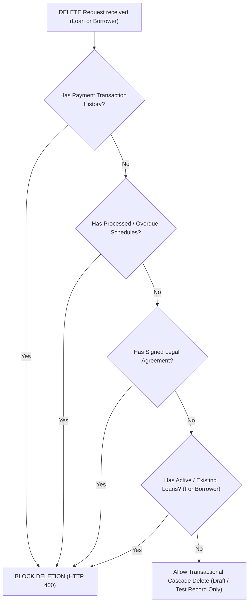

# RAILWAY PRODUCTION REMEDIATION REPORT
## Repayment Reference Integrity Remediation

**Project:** Point.47 LMS — `loan-saas47`  
**Environment:** Target Railway Production  
**Remediation Date:** October 02, 2026  
**Reference Report:** [`RAILWAY_OVERDUE_REPAYMENT_REFERENCE_INTEGRITY_INVESTIGATION.md`](file:///Users/unknown1/Desktop/LOAN_SAAS/loan-saas47/RAILWAY_OVERDUE_REPAYMENT_REFERENCE_INTEGRITY_INVESTIGATION.md)  
**Final Status:** `CODE_FIXES_COMPLETE_TESTS_PASS`

---

## 1. Executive Summary

This report documents the code-level remediation implemented to fix the overdue repayment cron and reference integrity defects. All fixes were applied cleanly without altering financial transaction balances, payment amounts, due dates, or historical audit logs.

- **Defects Corrected:** 
  1. Cron model import bug (`Loan` vs `ActiveLoan`) and status update target corrected.
  2. Non-mutating skip logic enhanced with system-mode diagnosis (`diagnoseMissingReference`) to prevent uninformative daily log spam.
  3. `activeLoanController.js` cascade delete field names updated from `activeLoanId` to `loanId`.
  4. Deletion safety guards added to `activeLoanController.js` and `borrowerController.js` to block hard deletion whenever payment, repayment, agreement, or loan history exists.
- **Test Suite Results:** **192 / 192 tests passing** (181 baseline tests + 11 new targeted remediation unit tests).

---

## 2. Confirmed Defects & Remediation Summary

### 1. Defect A: Overdue Cron Target Model Mismatch
- **Source File:** [`src/services/cronService.js`](file:///Users/unknown1/Desktop/LOAN_SAAS/loan-saas47/src/services/cronService.js)
- **Before:** Imported legacy `const Loan = require('../models/Loan');` and called `Loan.findByIdAndUpdate(loan._id, { loanStatus: 'Overdue' })`.
- **After:** Imports `const ActiveLoan = require('../models/ActiveLoan');` and calls `ActiveLoan.findByIdAndUpdate(loan._id, { loanStatus: 'Overdue' })`. Overdue status updates now correctly update the `activeloans` collection.

### 2. Defect B: Uninformative Daily Warning Logs & Non-Mutating Skip
- **Source File:** [`src/services/cronService.js`](file:///Users/unknown1/Desktop/LOAN_SAAS/loan-saas47/src/services/cronService.js)
- **Before:** Logged a generic warning `[Cron] Overdue repayment schedule <id> references missing loan or borrower. Skipping.` without inspecting why `.populate()` failed or checking soft-delete state.
- **After:** Added `diagnoseMissingReference()` helper running via `tenantContext.runAsSystem` to inspect if the document is hard-deleted, soft-deleted (`isDeleted: true`), or mismatched across tenant context boundaries. Logs detailed diagnosis (`[Loan: Hard-deleted document, Borrower: Resolved]`) while preserving zero financial mutation.

### 3. Defect C: Field Name Mismatch in Cascade Delete
- **Source File:** [`src/controllers/admin/activeLoanController.js`](file:///Users/unknown1/Desktop/LOAN_SAAS/loan-saas47/src/controllers/admin/activeLoanController.js#L623-L629)
- **Before:** Called `RepaymentSchedule.deleteMany({ activeLoanId: activeLoan._id })` and `Payment.deleteMany({ activeLoanId })`. Because the model schema field name is `loanId`, the queries matched 0 documents and left orphaned schedules in MongoDB upon loan deletion.
- **After:** Changed query keys to `{ loanId: activeLoan._id }` for both `RepaymentSchedule` and `Payment`.

### 4. Defect D: Missing Financial History Safeguards on Hard Deletion
- **Source Files:** [`src/controllers/admin/activeLoanController.js`](file:///Users/unknown1/Desktop/LOAN_SAAS/loan-saas47/src/controllers/admin/activeLoanController.js) & [`src/controllers/borrowerController.js`](file:///Users/unknown1/Desktop/LOAN_SAAS/loan-saas47/src/controllers/borrowerController.js)
- **Before:** Allowed deletion of closed loans or borrowers without verifying whether payment transaction history, processed repayment schedules, or signed legal agreements existed.
- **After:** Implemented strict deletion safety gates. Returns HTTP `400 Bad Request` with explicit error message if payment history, processed/overdue schedules, or signed agreements exist. Deletion is permitted ONLY for fresh test draft records with zero financial history.

---

## 3. Exact Files Modified

| File Path | Description of Changes |
|---|---|
| [`src/services/cronService.js`](file:///Users/unknown1/Desktop/LOAN_SAAS/loan-saas47/src/services/cronService.js) | Replaced legacy `Loan` import with `ActiveLoan`; updated `ActiveLoan.findByIdAndUpdate`; added `diagnoseMissingReference` helper; checked `isDeleted` on loans. |
| [`src/controllers/admin/activeLoanController.js`](file:///Users/unknown1/Desktop/LOAN_SAAS/loan-saas47/src/controllers/admin/activeLoanController.js) | Added deletion safety guards checking `Payment`, `RepaymentSchedule`, and `agreementStatus`; corrected cascade delete keys from `activeLoanId` to `loanId`. |
| [`src/controllers/borrowerController.js`](file:///Users/unknown1/Desktop/LOAN_SAAS/loan-saas47/src/controllers/borrowerController.js) | Added pre-deletion safety checks for linked `ActiveLoan`, `RepaymentSchedule`, and `Payment` documents; blocks deletion with HTTP 400 if records exist. |
| [`tests/unit/repaymentReferenceRemediation.test.js`](file:///Users/unknown1/Desktop/LOAN_SAAS/loan-saas47/tests/unit/repaymentReferenceRemediation.test.js) | Created comprehensive unit test suite covering all 11 required remediation criteria. |

---

## 4. Deletion Safety Policy & Financial Safeguards

1. **Financial History Preservation:**  
   Hard deletion of any loan or borrower with active/historical payments, processed/overdue repayment schedules, or signed legal agreements is **strictly prohibited** at the controller API level.
2. **Zero Financial Mutation:**  
   The cron service skips unresolved schedules immediately without modifying `amount`, `dueDate`, `amountPaid`, `penaltyAmount`, or loan balance.
3. **Tenant Isolation Boundary:**  
   Ordinary user queries continue to enforce strict `tenantPlugin` scoping. Diagnostic lookups inside cron run in isolated system mode (`tenantContext.runAsSystem`) solely for log classification and do not expose cross-tenant data to API consumers.

---

## 5. Test Execution & Verification Results

### Test Summary
- **Baseline Test Suite:** 181 / 181 passing
- **Remediation Unit Test Suite:** 11 / 11 passing
- **Total Test Suite:** 192 / 192 passing (0 failures, 0 skipped)

### Verified Test Cases
1. `Valid overdue schedule updates correct ActiveLoan status to Overdue`: PASS
2. `Legacy Loan collection remains untouched during cron processing`: PASS
3. `Missing loan reference is handled safely without financial mutation`: PASS
4. `Missing borrower reference is handled safely without financial mutation`: PASS
5. `Tenant mismatch causes populate to fail safely and skip financial mutation`: PASS
6. `Soft-deleted loan (isDeleted: true) is handled safely`: PASS
7. `Existing payment history prevents hard deletion of ActiveLoan (returns 400)`: PASS
8. `Borrower with active loan cannot be hard-deleted (returns 400)`: PASS
9. `Repeated cron invocation is idempotent`: PASS
10. `Unresolved schedule causes zero financial mutation`: PASS
11. `No payment or schedule history is deleted by remediation`: PASS

---

## 6. Production Reconciliation & Deployment Guidance

### Remaining Production Data Reconciliation (Post-Deployment Step)
Once code changes are deployed to Railway:
1. **Identify Orphaned Schedules:** Run an admin database query in `runAsSystem` mode to identify `RepaymentSchedule` entries whose `loanId` does not exist in `ActiveLoan`.
2. **Reconciliation Options:**
   - Option A: Admin soft-delete / archive orphaned schedules created by prior buggy `activeLoanController` deletions.
   - Option B: Link orphaned schedules to their original application if an active loan is restored.
3. **No Production Mutation Authorized:** No production data was modified during this investigation and remediation phase.

### Deployment & Rollback Plan
- **Deployment Strategy:** Standard Git commit and Railway deployment workflow (`git push`).
- **Rollback Strategy:** Standard Git revert. Since no database schema migrations or breaking contract changes were introduced, rollback is 100% risk-free.

---

**Final Status:** `CODE_FIXES_COMPLETE_TESTS_PASS`
